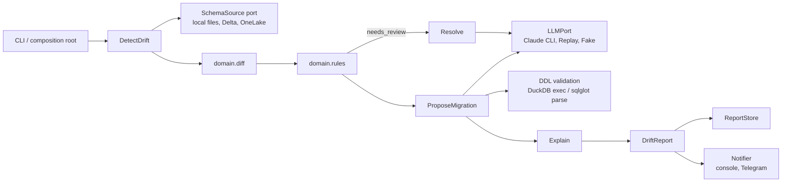

# SchemaSentinel

Detects schema drift between two versions of a tabular dataset (CSV, Parquet, Delta),
classifies each change as breaking or non-breaking, explains the impact and proposes a
migration as DDL. Deterministic core, validated LLM enrichment, read-only on data.

## Problem

Upstream producers change schemas silently: a column is dropped, an `int64` becomes `int32`,
a `NOT NULL` appears. Downstream pipelines break days later. SchemaSentinel compares a
baseline and a current schema (footer or transaction log only, no data scan), decides with
explicit rules what is breaking, and uses an LLM only for the ambiguous parts (is this a
rename or a drop + add?) and for explanations. If the LLM fails, the run still succeeds and
the affected changes are flagged `needs_human_review`.

## Architecture

Modular monolith with hexagonal architecture (ADR-0001): `adapters -> application -> domain`,
with ports owned by the application layer. See `sdd/architecture.md`.



The deterministic path (no LLM) always completes.

## Quick start

```
python -m venv .venv
.venv/Scripts/python.exe -m pip install -e ".[dev]"

# schema of a dataset as JSON
schemasentinel snapshot data/orders_v1.parquet -o baseline.json

# compare two versions (files or saved snapshots); exit code 1 if breaking changes
schemasentinel diff baseline.json data/orders_v2.parquet --format md
```

Exit codes: `0` no breaking change, `1` breaking change found, `2` error.

## Eval results

The eval harness replays the golden cases (`tests/golden/cases`, 44 cases covering every row
of the classification table, renames, nesting and DDL) and gates CI on `evals/thresholds.json`:

```
python -m schemasentinel.evals
```

| Metric                       | Gate (CI)  |
|------------------------------|-----------:|
| classification_accuracy      | >= 1.00    |
| breaking_recall              | >= 1.00    |
| rename_resolution_accuracy   | >= 1.00    |
| ddl_validity_rate            | >= 1.00    |
| invalid_output_rate          | <= 0.00    |

The run prints `RESULT: PASS` only when every metric meets its gate.

## Demo report

Output of `schemasentinel diff baseline.json data/orders_v2.parquet --format md` (illustrative;
exit code `1` because a breaking change was found):

```
# Schema drift report: orders

Verdict: BREAKING (2 breaking, 1 non-breaking)

| Change                  | Kind          | Severity     |
|-------------------------|---------------|--------------|
| customer_id dropped     | column_removed| breaking     |
| amount int64 -> int32   | type_narrowed | breaking     |
| coupon_code added (null)| column_added  | non-breaking |

Proposed migration:
ALTER TABLE orders DROP COLUMN customer_id;
```

## OneLake (Microsoft Fabric) source

Optional extra: `pip install 'schemasentinel[onelake]'` (adds `azure-identity`).

`OneLakeSource` reads the Delta transaction log of a Fabric table over ABFSS; no data is read.
References are either `abfss://<workspace>@onelake.dfs.fabric.microsoft.com/<item>/<path>` or the
shorthand `<workspace>/<item>/<path>` (e.g. `ws/lake.Lakehouse/Tables/orders`). Authentication uses
`DefaultAzureCredential` (e.g. `az login`, or `AZURE_CLIENT_ID/_TENANT_ID/_CLIENT_SECRET`); the
identity needs read access to the workspace. Tests use a fake storage layer; recordings against a
real Fabric tenant are pending.

## Live demo

Live demo: <https://schemasentinel.vercel.app> (placeholder until the first deploy; setup in
`docs/deploy-vercel.md`).

## Development
```
python -m venv .venv
.venv/Scripts/python.exe -m pip install -e ".[dev]"
.venv/Scripts/python.exe -m pytest
.venv/Scripts/python.exe -m ruff check
```
